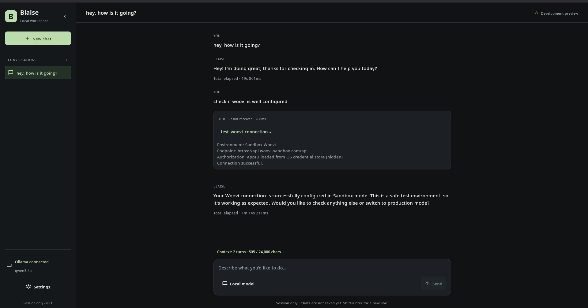

# Blaise Agent

**Financial operations through conversation, powered by local AI.**

Blaise Agent is an early Kotlin desktop application being built to connect a
ChatGPT-style chat to payment gateways through LangChain4j and Ollama. The first
planned integration is **Woovi's sandbox**, focused on creating Pix charges,
returning payment links, and checking charge status.

The name honors Blaise Pascal, who invented the Pascaline to help his father with
tax calculations.

## Desktop preview



User-captured desktop session showing the connection-check flow. Credentials are
hidden; the displayed durations are observations from this machine, not benchmarks.
Payment creation and durable conversation storage are still planned.

## Project status

**Desktop foundation.** The app now launches with a dark chat workspace, new/switch
conversation controls, editable drafts, example prompts, and a Settings screen.
Conversation orchestration has offline tests for streaming, cancellation, isolation,
and failure handling behind a replaceable agent interface.

Ollama health detection, local model discovery, model switching, and LangChain4j
streaming are now connected. On startup the app checks the local Ollama endpoint,
shows a toast with the result, discovers installed models from `/api/tags`, and
uses the selected model for chat. Woovi connection checks and Linux OS-backed
credential storage are connected. Charge creation and status lookup are not yet
implemented. Drafts and conversations live in memory and disappear when the app closes.

The sidebar can collapse from a 248 px conversation list to a 72 px icon rail.
Use the chevron to expand it, or the Conversations icon to reopen the list.
Icon actions have tooltips and accessible labels. Shared controls provide hover,
pressed, keyboard-focus, selected, disabled, and loading treatments. The header's
Development preview label is informational; its tooltip explains preview limits.
Refresh and model selection are unavailable while a response is running.

See [PLAN.md](PLAN.md) for milestones and acceptance criteria and [AGENTS.md](AGENTS.md)
for development conventions.

## The first experience

> **You:** Create a Pix payment link for R$150 for consulting.
>
> **Blaise:** Collects any missing required details, creates a charge through Woovi,
> and displays the gateway's payment link and charge status.
>
> **You:** Has it been paid?
>
> **Blaise:** Looks up the charge and reports the status returned by Woovi.

This is the intended experience, not an example of a currently working feature.

### Planned desktop interface

- Conversation sidebar with new-chat and history controls.
- Message thread, streaming responses, and a multiline composer.
- Visible tool activity and structured payment-result cards.
- Copy/open payment-link actions and charge-status refresh.
- Settings screen with secure Woovi credential management and Ollama configuration.
- Model picker populated dynamically from Ollama, with refresh and switching
  between installed local models.

## Technology and architecture

- **Kotlin/JVM and Java 21** for the application.
- **Compose Desktop and Material 3** for the interface.
- **LangChain4j** for the AI service, conversation context, and tool calling.
- **Ollama** for locally hosted inference.
- **Woovi sandbox** as the planned first gateway.

Target integration architecture:

```text
Compose Desktop → ChatViewModel → LangChain4j ↔ Ollama
                                       ↓ tools
                               Payment operations
                                       ↓
                               PaymentGateway
                                       ↓
                                Woovi sandbox
```

The model interprets requests; Kotlin validates arguments and executes operations.
Payment links and statuses come from gateway responses. Gateway credentials stay
in the adapter configuration, outside model context. Local inference still requires
network access to Woovi for payment operations.

The project uses one Gradle application under `desktop/`, with `ui`, `state`,
`agent`, `payments`, and `config` packages. The `storage` package is planned.
The Compose Desktop structure
and restrained dark theme of [MindGraph](https://github.com/iagxferreira/mindgraph)
are references for the desktop experience.

## Planned startup behavior

1. Open the desktop shell and check the configured Ollama endpoint in the background
   (default: `http://127.0.0.1:11434`).
2. Reuse a responding service; do not start another instance.
3. If a local service is unavailable, offer a start action using the installed
   `ollama serve` command, plus diagnostics and retry. Remote endpoints receive
   connection diagnostics rather than local process management.
4. Discover installed models and use the first available model for the initial chat.
   Model selection and tool-call suitability checks are next.
5. Show Woovi configuration separately, so ordinary chat can work without gateway
   credentials.

## Settings and secure storage

Settings offers a masked Woovi API-key field with save, replace, remove, and
test-connection actions. Linux Secret Service is implemented via `secret-tool`;
macOS Keychain, Windows Credential Manager, and session-only credential input are
planned. Unavailable secure storage is reported without a plaintext fallback.
Keys must never enter chat history, model context,
ordinary preferences, exports, or logs.

Ollama settings provide an editable endpoint, a Test connection action, dynamic
model discovery from `GET /api/tags`, refresh, and model switching when no response
is in flight. A failed endpoint test leaves the current chat connection unchanged.
Saved selection and payment-tool capability checks are upcoming.

Woovi sandbox API keys can now be saved, replaced, and removed through Settings. On
Linux, Blaise uses Secret Service through `secret-tool`; if that secure store is
unavailable, the app does not silently write plaintext and reports that session-only
credentials are required. The key is passed as Woovi's `Authorization` header
without adding a `Bearer` prefix.

Settings separates Woovi **Sandbox** and **Live** environments, with independent
secure credential slots and base URLs. Live mode is visibly marked as the real-money
environment; the first payment flow remains sandbox-focused. A non-mutating
connection test checks the selected environment's company endpoint using the saved
AppID and never sends the key to Ollama or includes it in error messages.

The same connection check is available from chat: with a saved key, ask the local
model to "test my connection with the Woovi environment". The model can request only
the fixed, no-argument connection tool; environment selection and credential access
remain controlled by the application.

The agent now executes only native structured tool calls. JSON written in ordinary
model text is not executable. Each turn allows one validated, no-argument Woovi
check followed by a model response with tools disabled. Streaming text comes from
the model; application failures are surfaced through the response status. The
versioned base instructions live in `agent/PromptComposer.kt`.

If a model returns a JSON tool description as ordinary text, the completed response
shows an APP notice with expandable original model output. No tool is executed by
this text, and the unsuccessful assistant response is excluded from future context.
Ollama's advertised `tools` capability alone is not proof of working native calls.

Conversation context retains paired native tool requests/results with call IDs,
while excluding cancelled or failed assistant text. Older turns are evicted whole
using a 24,000-character history budget; the latest turn is retained even if it
exceeds that budget. This is not a model-specific token limit. Conversation
persistence and explicit global preferences remain planned; chats are session-only.

The composer includes an expandable context preview showing included turns, tool
results, history character usage, and excluded older turns. It includes the current
draft and is a preview, not a record of a request already sent. Tool calls and their
paired results appear as one expandable card. Cards distinguish running, result
received, and stopped without a recorded result; provider success/failure remains
in the result details until typed outcome presentation is implemented.

Responses show live elapsed waiting time and retain total duration on completion,
failure, or cancellation. Tool cards retain their own execution duration, excluding
model generation before and after the tool. Durations use a monotonic clock and
remain in session memory only; they are not sent to the model.

## Build and run

Install **JDK 21** and point `JAVA_HOME` to it. The Gradle wrapper is checked in;
no separate Gradle installation is required. Use JDK 21 to run Gradle as well as
compile the app; the pinned Gradle 8.11.1 wrapper does not support running on JDK 25.

From the repository root:

```sh
./desktop/gradlew -p desktop build
./desktop/gradlew -p desktop test
./desktop/gradlew -p desktop run
```

Or, from `desktop/`, use `./gradlew build`, `./gradlew test`, and `./gradlew run`.
The first build downloads Gradle and Maven dependencies. Running the UI requires a
graphical desktop session. Offline tests need neither Ollama nor Woovi credentials.
Chat requires a running Ollama instance; connection checks contact Woovi using the
selected environment's saved credential.

Test reports are generated in `desktop/build/reports/tests/test/index.html`.

### Local model setup

On the development machine (Xeon E5-2690 v4, 32 GB RAM, GTX 1050 Ti 4 GB),
`qwen3:4b` completed a native tool-call probe and a synthetic result follow-up
through Ollama with thinking enabled and a 4,096-token context. The user also
demonstrated a Woovi check in Blaise. These observations are not a guarantee for
other configurations; automatic model compatibility verification is still pending.

```sh
ollama pull qwen3:4b
```

Refresh models in Settings and select the downloaded model. Downloads are explicit;
Blaise does not automatically install models. The app currently uses adapter defaults
for thinking and token context; its character history budget is a separate limit.
`qwen2.5-coder:3b` returned JSON prose rather than a native call in the local probe.

For gateway testing, create a separate account at
[Woovi sandbox](https://app.woovi-sandbox.com/) and obtain sandbox API credentials.
Production credentials do not work in that environment. Never commit credentials,
real customer data, or local conversation history.

## Development approach

Work in small, independently verifiable changes using Conventional Commits, such as
`feat(ollama): discover local models` and `feat(woovi): create sandbox charges`.
Keep documentation aligned with delivered behavior. Detailed rules live in
[AGENTS.md](AGENTS.md).

## References

- [Implementation plan](PLAN.md)
- [Woovi documentation](https://developers.woovi.com/en/docs/intro/getting-started)
- [Woovi sandbox setup](https://developers.woovi.com/en/docs/intro/test-environment)
- [Woovi API reference](https://developers.woovi.com/en/api)
- [LangChain4j](https://docs.langchain4j.dev/)
- [Ollama](https://docs.ollama.com/)
